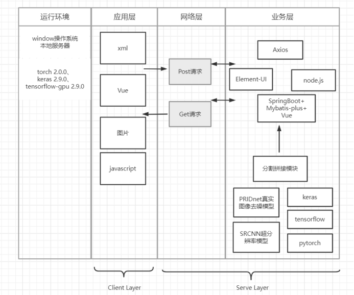

# Image quality improvement system based on deep learning

## Description

- An image quality processing system.
- Use PRIDNet and SRCNN for denoising and super resolution.
- The system interface using SpringBoot,Mybatis plus and Vue 

## 金字塔真实图像去噪网络(PRIDNet)参考资料

### Abstract

​	作者团队提出了用于real-wolrd noisy images的盲去噪(**blind denoising**)的**PRIDNet**。网络结构包括顺序连接的3个部分：**Noise Estimation**(探讨特征通道的相对重要性)、**Multi-scale Denoising**(使用金字塔池化进行多尺度特征去噪)、**Feature Fusion**(自适应核选择特征融合).

​	在两个real-wolrd noisy datasets（DND）上测试的结果表明PRIDNet已经可以在定量分析和视觉感知质量上达到SOTA denoisers的水平。(具体见paper)

​	paperwithcode的denoising领域里PSNR值的[rank 2](https://paperswithcode.com/sota/color-image-denoising-on-darmstadt-noise) 

### Network

### paper&code

- paper：[PRIDNet_pdf](https://arxiv.org/pdf/1908.00273.pdf )( VCIP 2019 oral )

- code1: [Code for the paper "Pyramid Real Image Denoising Network"](https://github.com/491506870/PRIDNet)（这是paper的github开源代码，使用tensorflow框架、只包含RAW域denoising的train和test代码及其他资料连接）
- code2：[image-Denoising-using-Deep-Learning](https://github.com/chintan1995/Image-Denoising-using-Deep-Learning)（keras框架、针对sRGB文件,具体在Models/PRIDNet_256x256.ipynb中）

### Dataset 

- |           数据集名称           |                             介绍                             |                           链接地址                           |
  | :----------------------------: | :----------------------------------------------------------: | :----------------------------------------------------------: |
  |              SIDD              | SIDD is an image denoising dataset containing 30,000 noisy images from 10 scenes under different lighting conditions using five representative smartphone cameras. |  [SIDD](https://www.eecs.yorku.ca/~kamel/sidd/dataset.php)   |
  |    SIDD_Medium_Raw_Dataset     |          SIDD 中型Raw数据集（code1中使用的训练集）           | [百度网盘](https://pan.baidu.com/s/1-vVKv4zDT2WyevktUTZZlA?pwd=1234) |
  |      SIDD_Benchmark_Data       | SIDD数据集sRGB的benchmark测试数据、全画幅data等(作为code1的Validation) | [百度网盘](https://pan.baidu.com/s/1wSmReyzp2L9qfvPetde6ag?pwd=1234) |
  | trained_model(code1的训练模型) |   针对Raw图像3991次训练后保存的ckpt文件，对本项目帮助不大    | [百度网盘](https://pan.baidu.com/s/1YOhs3DDiFmx8CqUs4sbNSg)  |
  |     SIDD_small_-srgb_only      |          SIDD 小型sRGB数据集（code2中使用的训练集）          | [百度网盘](https://pan.baidu.com/s/1sAj3v6SY_Y3u-anMdcrt0Q?pwd=1234) |
  |        SIDD_MIDDLE_sRGB        |           SIDD中型sRGB训练集（本项目使用的训练集）           | [百度网盘](https://pan.baidu.com/s/1wSmReyzp2L9qfvPetde6ag?pwd=1234) |
  |          Mi3_Aligned           |                 code2中其他模型使用的数据集                  | [百度网盘](https://pan.baidu.com/s/1At5vRVAmUJP-iALXU9UFrQ?pwd=1234) |
  |              DND               |                 paper里的模型测试对比验证集                  |      [百度网盘](https://pan.baidu.com/s/1J2JLAumsuRtWWGkXHAdJOw?pwd=1234)                          |
  |                                |                                                              |                                                              |

  SIDD数据集官网服务器连接有时断联，提供百度网盘连接参考。

## SRCNN参考

​	CNN进行超分开山之作，结构简单不再赘述

- paper: [ Image Super-Resolution Using Deep Convolutional Networks ](https://arxiv.org/abs/1501.00092)
- code: [SRCNN](https://github.com/yjn870/SRCNN-pytorch) (pytorch框架、与原论文代码在优化器等问题上有部分改动)

## 系统框架

## 处理流程

## ***本地运行环境***

操作系统：			Windows 10 64位操作系统

Web应用服务器：	Tomcat9.0

Java运行环境：	JDK1.8.0

Python运行环境：	Python3.9.7

深度学习模型：	torch 2.0.0、keras 2.9.0、tensorflow-gpu 2.9.0

操作系统： Windows 10 64位

CPU：		Intel Core i5-10300H

内存：		16.0 GB

## 文件结构

### back\src\main\java\org\app\

- DownFileService.java下载文件方法
- Controller.java中包含上传文件方法
- PythonAgent.java调用PRIDNet进行处理的方法、PythonSRCNN.java调用SRCNN进行处理的方法

### front\src\components\

- CompareImage.vue对比界面实现
- Home.vue首页
- Uploads.vue上传处理界面

### OriginalPicture\

- cut文件夹 原图分割处理中间结果
- OriginalPicture.png上传后服务器保存的图像名称
- OriginalPicture_prid.jpg去噪处理结果图
- OriginalPicture_prid_srcnn_x3.jpg去噪并超分结果图
- R-C.jpg背景图

### testvideo\ 

- 演示视频使用的测试图

## 使用方法

1. 将本项目中的AIPicture文件夹解压到D:\目录下（否则要修改VUE、py等文件中的地址配置），依赖配置已保存到项目，运行前修改或安装环境地址application中的java1.8.0和node中的node.js18.15，
2. 本地安装anaconda3并安装对应包和框架以运行testprid.py和testsrcnn.py
3. 根据使用的虚拟环境路径修改PythonAgent.java和PythonSRCNN.java中的运行环境路径
4. 在D:\AIPicture\back\src\main\java\org\app\Python\pridnet\model\目录下添加PRIDNet模型文件。
   1. 模型框架和参数大小3.3G左右，可在md文件中的网盘连接下载。训练次数为200次左右learning rate 为0.00009,模型在测试集上psnr为37.13可进一步训练以提高效果
   2. 或者使用train.py、train.ipynb自行进行训练模型，代码为autodl上使用jupterLab运行的部分源码。

5. 将模型放置后使用IDEA2020打开该项目，运行Application
6. 在终端输入cd front
7. 在终端输入npm run serve运行服务。后端服务在8080端口运行。
8. 点击网址即可运行本系统。建议使用Google浏览器.使用edge会出现无法刷新等现象。

- 点击[演示视频](https://pan.baidu.com/s/131E6841v322_PorAd3UKaw?pwd=1234)查看详细界面演示

- 

## 联系方式

- Mail：liyangh123@gmail.com
